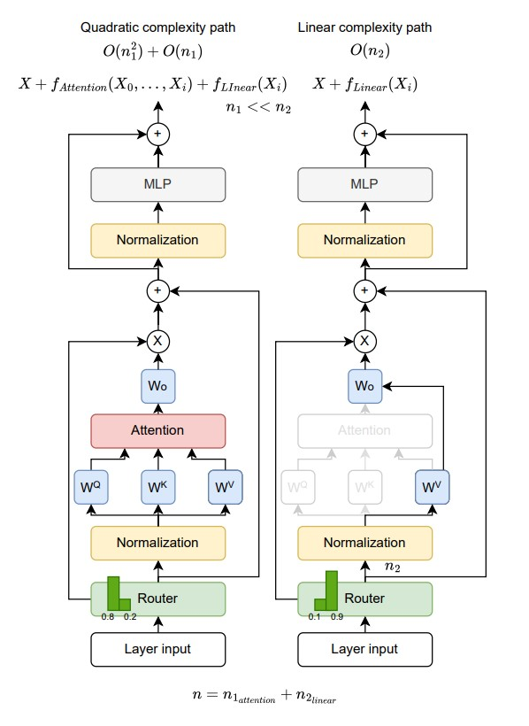

## DTRNet: Dynamic Token Routing Network to Reduce Quadratic Costs in Transformers

<a target="_blank" href="">
</a>
<a target="_blank" href="https://github.com/Aman26Sharma/DTRNet">
</a>
<!-- <a target="_blank" href="https://twitter.com/DongfuJiang/status/1805438506137010326">
</a> -->
<br>


### 🚀 Introduction

Transformers achieve state-of-the-art results across many tasks, but their uniform application of quadratic self-attention to every token at every layer makes them computationally expensive. %However, many tokens do not require such heavy computation: layer-wise cosine similarity analysis of dense Transformers reveals that inner-layer token embeddings change only marginally across adjacent layers, indicating substantial computational redundancy. We introduce DTRNet (Dynamic Token Routing Network), an improved Transformer architecture that allows tokens to dynamically skip the quadratic cost of cross-token mixing while still receiving lightweight linear updates. By preserving the MLP module and reducing the attention cost for most tokens to linear, DTRNet ensures that every token is explicitly updated while significantly lowering overall computation. This design offers an efficient and effective alternative to standard dense attention. Once trained, DTRNet blocks routes only ~10\% of tokens through attention at each layer while maintaining performance comparable to a full Transformer. Its efficiency gains, scales with sequence length, offering significant reduction in FLOPs for long-context inputs. By decoupling token updates from attention mixing, DTRNet substantially reduces the quadratic share of computation, providing a simple, efficient, and scalable alternative to Transformers.

<div align="center">

<p><em>Figure 1: DTRNet Layer. Left: tokens routed to the self-attention path undergo full cross-token mixing. Right: tokens routed to the projection-only (bypass) path skip mixing and receive a token-local update via the value projection (W_V) and output projection (W_O), followed by the shared feed-forward network (FFN). Both paths share parameters.</em></p>
</div>

### 🛠 Implementation

DTRNet is implemented using the **Hugging Face Transformers** library and currently supports:

- **LLaMA model family**
- **SmolLM model family** (training experiments conducted on SmolLM-360M)

#### Key Features
- DeepSpeed **Zero-3** / PyTorch **DDP** optimization.
- YAML-based configuration system for experiments.
- **Weights & Biases (WandB)** integration for experiment tracking.
- Modular codebase for easy integration with new models.


### ⚙ Experimental Setup

Experiments are configured through YAML files in the `experiments/` directory, specifying:
- Base model config (e.g., `HuggingFaceTB/SmolLM-360M`)
- DTRNet layer placement (e.g., layers `2,4,6`)
- Training hyperparameters (learning rate, batch size, sequence length)

Modify these files to adjust your setup.

---

### 📦 Installation

```bash
git clone https://github.com/Aman26Sharma/DTRNet.git
cd DTRNet
pip install -r requirements.txt
pip install flash-attn --no-build-isolation

# Install lm-evaluation-harness
cd lm-evaluation-harness
pip install -e .
```

### 📈 Training

To train a model with DTRNet layers, use the provided training script:

```bash
bash train_pt.sh
```
- Update the training scripts (train_pt.sh) with your desired configuration.
- Training logs and checkpoints will be stored in the specified output directory.


### ✅ Evaluation

We use **lm-evaluation-harness** to evaluate model performance on downstream tasks.

```bash
cd lm-evaluation-harness
bash run_eval.sh
```

**Note:** 
Before running evaluation, update the huggingface.py loader in lm-evaluation-harness/lm_eval/models/ to point to the DTRNet implementation.
Example for loading a DTRNet-based LLaMA:

'''python
from transformers_extra.models.DTRNet_smollm.modeling_llama_DTRNet import LlamaForCausalLM
'''

### 📝 Conclusion

We introduced DTRNet, a dynamic token routing architecture that reduces Transformer inference cost by decoupling attention from token updates. By replacing full-layer skipping with a linear path that retains the MLP, DTRNet ensures that all tokens receive meaningful updates, even when attention is bypassed. This lightweight linear path enables substantial compute savings while maintaining accuracy.

### 🙏 Acknowledgements

This project builds upon and extends work from several open-source projects and research efforts:

- **SmolLM** models by [Hugging Face](https://huggingface.co/HuggingFaceTB) — lightweight language models used for DTRNet training and benchmarking.
- **Hugging Face Transformers** library ([repo](https://github.com/huggingface/transformers)) — core model and training framework.
- **DeepSpeed** ([repo](https://github.com/microsoft/DeepSpeed)) — for efficient distributed training and memory optimization (ZeRO-3).
- **FlashAttention** ([paper](https://arxiv.org/abs/2205.14135), [repo](https://github.com/Dao-AILab/flash-attention)) — optimized attention computation used in the implementation.
- **TRL Experiments** ([repo](https://github.com/arianhosseini/trl-code)) — provided the base training pipeline structure that DTRNet builds upon.
- **lm-evaluation-harness** ([repo](https://github.com/EleutherAI/lm-evaluation-harness)) — for standardized evaluation on downstream tasks.


We gratefully acknowledge the authors and maintainers of these projects for their contributions to the open-source and research community.


### 📚 Citation

If you use DTRNet in your research, please cite:

```bibtex
```

### 📜 License

This project is licensed under the terms of the license included in the repository.

### 📬 Contact

For questions or issues, please open an issue on the GitHub repository or contact the authors directly.


